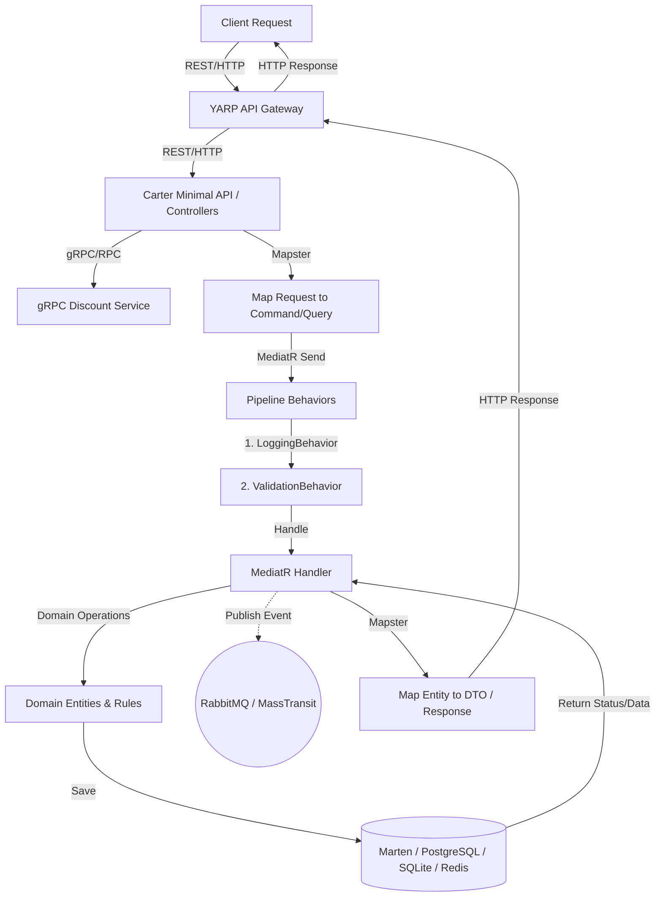

# Instashop Project Architecture

## 📌 Project Overview
**Instashop** is a modern e-commerce microservices application built with **.NET 10**. The solution demonstrates scalability, maintainability, and domain-driven design by partitioning the system into bounded contexts and employing optimized architectures based on each service's complexity.

---

## 🏗️ Architectural Patterns

### 1. Hybrid Architectures
Depending on the service's complexity, we use different architectural patterns:
*   **Vertical Slice Architecture (Catalog, Basket):** Features are organized by feature folders ("slices") rather than technical layers. The endpoint, MediatR command/query, handler, and validators are colocated. This reduces navigation overhead and ensures that changes to a feature are localized.
*   **Clean Architecture (Ordering):** Divided into domain, application, infrastructure, and API layers to handle complex enterprise business logic, rich domain events, and state mapping.

### 2. CQRS (Command Query Responsibility Segregation)
All services strictly segregate read (Queries) and write (Commands) operations using the **CQRS** pattern, orchestrated by **MediatR**:
*   **Commands:** Represent intentions to change application state (e.g., `CreateProductCommand`). Implements `ICommand` and is handled by `ICommandHandler`.
*   **Queries:** Represent requests to retrieve application state (e.g., `GetProductsQuery`). Implements `IQuery` and is handled by `IQueryHandler`.
*   **Benefit:** This allows for independent optimization of read and write paths (e.g., using a cache for queries while writing directly to the database).

### 3. Domain-Driven Design (DDD)
The system is designed around domain models that encapsulate business logic and state, particularly in the Ordering service:
*   **Entities & Aggregate Roots:** Enforce business invariants (e.g., `Order`, `Product`).
*   **Value Objects:** Immutable types without identity (e.g., `Address`, `Payment`, `OrderName`).
*   **Domain Events:** Triggered when state changes, dispatched using `DispatchDomainEventInterceptor` before EF database transactions commit.
*   **Bounded Contexts:** Each microservice operates within its own bounded context with its own isolated database.

---

## 🛠️ Technology Stack

| Component | Technology | Bounded Context / Purpose |
| :--- | :--- | :--- |
| **Framework** | .NET 10 | Core runtime for all services |
| **Minimal APIs** | **Carter** | Catalog, Basket & Media API endpoint routing |
| **REST APIs** | **Controllers** | Ordering API endpoint routing |
| **RPC Communication** | **gRPC** | Discount.Grpc service communication |
| **Mediator** | **MediatR** | Decoupling endpoints from feature handlers |
| **Document Store** | **Marten (PostgreSQL)** | Catalog & Basket NoSQL document store |
| **Relational Database** | **EF Core + PostgreSQL** | Ordering service data store |
| **Local Database** | **EF Core + SQLite** | Discount service lightweight data store |
| **Distributed Cache** | **Redis** | Cached Basket Repository decorator |
| **Validation** | **FluentValidation** | MediatR pipeline automatic request validation |
| **Mapping** | **Mapster** | Request/Response and Entity/DTO mapping |
| **Message Broker** | **RabbitMQ & MassTransit** | Asynchronous event-driven communication |
| **API Gateway** | **YARP** | Centralized routing to backend microservices |
| **Web Frontend** | **Razor Pages & Refit** | Shopping.Web UI and API consumption |
| **Containerization**| **Docker & Docker Compose** | Local orchestrations of backend microservices |

---

## 📦 Service Breakdown & Data Management

### 🛍️ Catalog Service (`Catalog.API`)
*   **Pattern:** Vertical Slice Architecture
*   **Database:** Marten (PostgreSQL Document Store)
*   **Responsibilities:** Inventory, category management, product listings, pagination, and static file hosting (e.g., product images).

### 🛒 Basket Service (`Baket.API`)
*   **Pattern:** Vertical Slice Architecture
*   **Database:** Marten (PostgreSQL Document Store) + Redis (caching)
*   **Caching Strategy:** Decorator pattern via `CachedBasketRepository` wrapping the database repository.
*   **Dependencies:** Consumes `Discount.Grpc` to fetch and apply coupon amounts.

### 🏷️ Discount Service (`Discount.Grpc`)
*   **Pattern:** gRPC Service
*   **Database:** EF Core (SQLite, database file `DiscountDb.db`)
*   **Responsibilities:** High-performance gRPC server handling coupon discounts (`GetDiscount`, `CreateDiscount`, `UpdateDiscount`, `DeleteDiscount`).

### 📦 Ordering Service (`Ordering`)
*   **Pattern:** Clean Architecture (DDD)
*   **Database:** EF Core (PostgreSQL)
*   **Layers:**
    *   `OrderingDomain`: Core domain entities (`Customer`, `Product`, `Order`, `OrderItem`), value objects, custom exceptions, and domain events.
    *   `Ordering.Application`: MediatR commands/queries, mapping (Mapster), DTO definitions, and data abstractions (`IApplicationDbContext`).
    *   `Ordering.Infrastructure`: Data access implementations (`ApplicationDbContext` with EF configurations, migrators, entity interceptors).
    *   `Ordering.API`: Web controllers delivering endpoints and calling the MediatR pipeline.

### 📸 Media Service (`Media.API`)
*   **Pattern:** Minimal APIs
*   **Database:** Local File System (`wwwroot/images`)
*   **Responsibilities:** Handling file uploads and serving static media assets (e.g., product images).

### 🌐 Web Application (`Shopping.Web`)
*   **Pattern:** Razor Pages Web Application
*   **Responsibilities:** Client-facing user interface, consuming backend microservices via Refit and YARP API Gateway.
*   **Hosting:** Runs natively (outside of Docker Compose) for faster local UI development.

---

## 🧩 Cross-Cutting Concerns (`BuildingBlocks`)

The `BuildingBlocks` project provides shared abstractions and behaviors used across all microservices:

*   **CQRS Abstractions:** Defines `ICommand`, `IQuery`, and their respective handlers.
*   **MediatR Pipeline Behaviors:**
    *   **ValidationBehavior:** Automatically validates every `ICommand` using FluentValidation before it reaches the handler.
    *   **LoggingBehavior:** Provides standardized request/response logging and performance monitoring (logs warnings for requests taking longer than 3 seconds).
*   **Exception Handling:** Centralized middleware for capturing and formatting API errors.
*   **Messaging (`BuildingBlocks.Messaging`):** Integrates **MassTransit** and **RabbitMQ** for asynchronous event-driven communication across bounded contexts.

---

## 📂 Directory Structure

```text
Instashop/
├── ApiGateways/                    # API Gateways routing requests to internal microservices
│   └── YarpApiGateway/             # Central entry point using YARP
├── BuildingBlocks/                 # Shared abstractions, CQRS interfaces, and pipeline behaviors
│   ├── BuildingBlocks/             # Cross-cutting concerns (Behaviours, Exceptions, Pagination)
│   └── BuildingBlocks.Messaging/   # Async messaging abstractions (MassTransit, RabbitMQ)
├── Services/
│   ├── Catalog/
│   │   └── Catalog.API/            # Catalog Microservice (Vertical Slice, Marten)
│   │       ├── Products/           # Feature slices (e.g. CreateProduct, GetProducts)
│   │       └── Models/             # Catalog Entities
│   ├── Basket/
│   │   └── Baket.API/              # Basket Microservice (Vertical Slice, Marten + Redis)
│   │       ├── Basket/             # Feature slices (e.g. StoreBasket, GetBasket)
│   │       └── Data/               # Repositories (Decorated Caching Logic)
│   ├── Discount/
│   │   └── Discount.Grpc/          # Discount RPC Service (gRPC, EF Core + SQLite)
│   │       ├── Data/               # DiscountContext & Extensions
│   │       ├── Protos/             # Protocol Buffer contract (discount.proto)
│   │       └── Services/           # Discount gRPC Service Handlers
│   ├── Media/
│   │   └── Media.API/              # Media Microservice (Carter, Static Files)
│   │       └── Endpoints/          # File upload and deletion endpoints
│   └── Ordering/                   # Ordering Microservice (Clean Architecture + DDD)
│       ├── OrderingDomain/         # Domain (Models, ValueObjects, Events, Exceptions)
│       ├── Ordering.Application/   # Application logic (Commands, Queries, DTOs, IApplicationDbContext)
│       ├── Ordering.Infrastructure/# Infra (ApplicationDbContext, Configurations, Interceptors)
│       └── Ordering.API/           # Presentation layer (Controllers, Endpoints)
├── WebApps/                        # Frontend web applications
│   └── Shopping.Web/               # Razor Pages UI consuming the microservices via Refit
└── docker-compose.yml              # Infrastructural setup (PostgreSQL, Redis, RabbitMQ, and backend microservices)
```

---

## 🚀 Execution Flow



---

## 💡 Key Coding Guidelines

1.  **Do Not Bypass MediatR:** Keep endpoints thin. API controllers/minimal APIs must only receive requests, translate/validate, send commands/queries to MediatR, and return HTTP status codes.
2.  **Ensure Colocation in Slices:** When adding/modifying features in `Catalog.API` or `Baket.API`, keep endpoints, models, handlers, and validators inside the feature's vertical slice folder (e.g., `Services/Catalog/Catalog.API/Products/CreateProduct/`).
3.  **Strict Clean Architecture Isolation in Ordering:** 
    *   Do not reference `Ordering.Infrastructure` in `Ordering.Application` or `OrderingDomain`.
    *   Do not reference `Ordering.Application` in `OrderingDomain`.
    *   Any infrastructure dependency must be registered through dependency injection using abstractions defined in the `Application` layer.
4.  **Save Changes Interceptors:** Always leverage `AuditableEntityInterceptor` for automatic creation/modification timestamps, and `DispatchDomainEventInterceptor` for dispatching aggregate events.
5.  **Use Primary Constructors:** Utilize C# 12+ primary constructor syntax for dependency injection where applicable (e.g., `public class Handler(IApplicationDbContext dbContext) : ...`).
