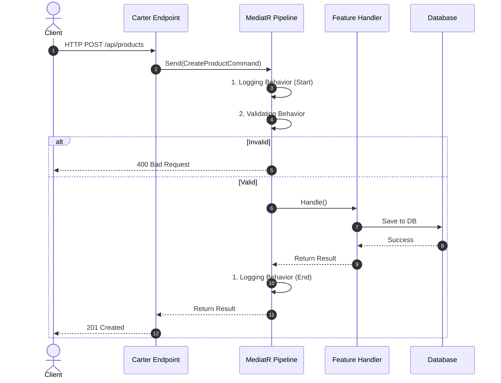
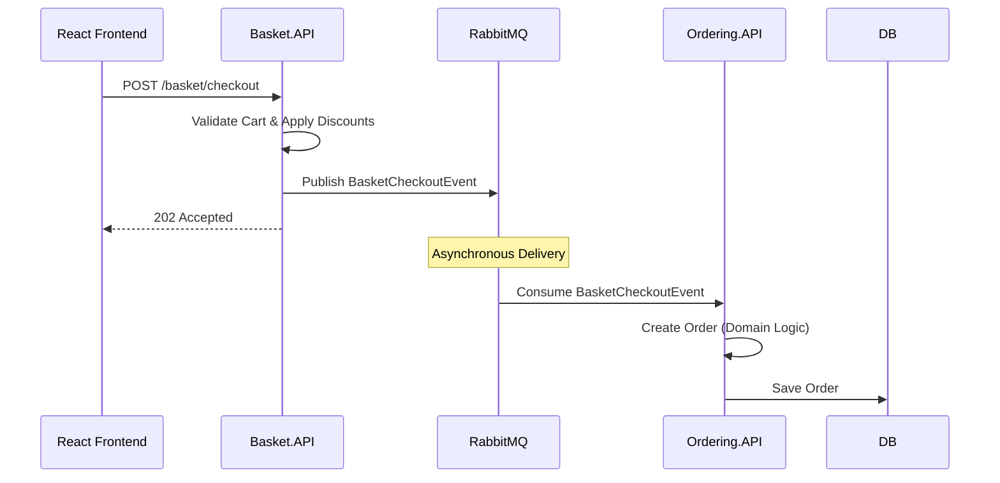

# 🏗️ Instashop Architecture Deep Dive

## 📌 Project Vision & Overview
**Instashop** is a state-of-the-art e-commerce microservices platform built on **.NET 10**. It serves as a comprehensive reference architecture for building scalable, maintainable, and highly performant enterprise systems. 

This document outlines the architectural patterns, bounded contexts, execution flows, and engineering guidelines that govern the Instashop codebase.

---

## 🧩 Core Architectural Patterns

### 1. Hybrid Architecture Strategy
We reject the "one size fits all" approach. Services use the architecture that best fits their domain complexity:

*   **Vertical Slice Architecture (Catalog, Basket):** 
    Features are organized by folders ("slices") rather than technical layers. The endpoint, MediatR command, handler, and validators live side-by-side. This maximizes cohesion and minimizes navigation overhead for simple CRUD-heavy domains.
*   **Clean Architecture & DDD (Ordering):** 
    Divided into Domain, Application, Infrastructure, and API layers. This is essential for the Ordering service, which contains complex business logic, rich domain events, and strict invariants that must be protected.

### 2. CQRS (Command Query Responsibility Segregation)
Every microservice strictly segregates read operations from write operations using **MediatR**:
*   **Commands (Writes):** Change system state. Handled by `ICommandHandler`.
*   **Queries (Reads):** Retrieve system state. Handled by `IQueryHandler`.
*   *Advantage:* We can independently scale and optimize read and write paths, applying caching to queries while wrapping commands in database transactions.

### 3. Event-Driven Messaging
Services are decoupled using **RabbitMQ** and **MassTransit**.
*   Instead of synchronous HTTP calls (which cause cascading failures), services publish integration events (e.g., `BasketCheckoutEvent`).
*   Subscribing services react to these events asynchronously, ensuring **eventual consistency** and high fault tolerance.

---

## 📦 Bounded Contexts & Services

| Service | Architecture | Datastore | Responsibility |
| :--- | :--- | :--- | :--- |
| **Catalog.API** | Vertical Slice | Marten (PostgreSQL) | Product catalog, inventory, and categories. |
| **Basket.API** | Vertical Slice | Redis + Marten | User shopping carts. Uses Decorator pattern for caching. |
| **Ordering.API** | Clean Architecture | EF Core (PostgreSQL)| Order lifecycle, payment info, shipping details. |
| **Discount.Grpc** | gRPC Service | EF Core (SQLite) | High-speed RPC coupon calculation. |
| **Identity.API** | Minimal API | EF Core (PostgreSQL)| JWT issuance, user registration, role management. |
| **Media.API** | Minimal API | Local File System | Static asset and image hosting. |
| **YarpApiGateway**| Gateway | N/A | Centralized routing, rate limiting, and CORS handling. |
| **React Frontend**| SPA (Vite) | N/A | The customer-facing UI interacting with YARP. |

---

## 🛠️ The `BuildingBlocks` Core

To prevent code duplication, cross-cutting concerns are extracted into a shared `BuildingBlocks` library:

1. **MediatR Pipeline Behaviors:**
   * `ValidationBehavior`: Automatically validates every incoming request using FluentValidation before it ever reaches the handler.
   * `LoggingBehavior`: Logs request entry, exit, and execution time (warning if execution exceeds 3 seconds).
2. **Global Exception Handling:**
   * A centralized `CustomExceptionHandler` catches domain exceptions and maps them to RFC 7807 compliant `ProblemDetails` (e.g. mapping `NotFoundException` to a HTTP 404 response).
3. **Messaging Setup:**
   * Standardized MassTransit/RabbitMQ configurations to easily publish and consume events across microservices.
4. **Authentication:**
   * Shared JWT verification extensions to ensure consistent security across all internal APIs.

---

## 🚀 Execution Flows

### 1. Standard API Request (CQRS + Validation)

### 2. Event-Driven Checkout Flow

---

## 💡 Engineering Guidelines & Rules

If you are developing or modifying code in this repository, you **must** adhere to the following rules:

1. **Keep Endpoints Thin:** Carter endpoints and API Controllers must contain zero business logic. They should only map requests, send them to MediatR, and return HTTP status codes.
2. **Respect the Architecture:** 
   * In `Catalog` and `Basket`, put your Command, Handler, and Validator in the same folder.
   * In `Ordering`, strictly maintain Clean Architecture isolation. `OrderingDomain` must have no dependencies on infrastructure or application layers.
3. **Aggregate Mutations:** When updating an aggregate root (like `Order`), orchestrate the changes exclusively through the aggregate's methods (e.g., `order.AddOrderItem()`). Never mutate child entities directly.
4. **Domain Events:** Use `DispatchDomainEventInterceptor` to dispatch events triggered by aggregates. Always call `ClearDomainEvents()` after dispatch to prevent infinite loops.
5. **Modern C# Features:** Use C# 12 primary constructors for dependency injection (e.g., `public class GetProductsHandler(IDocumentSession session) { ... }`).
6. **EF Core & Enums:** If configuring an enum property with a database-generated default, configure the sentinel value via `.HasSentinel((EnumType)0)` and register `JsonStringEnumConverter` for JSON serialization.
7. **CORS Configuration:** Ensure CORS policies are correctly propagated via YARP and fallback middleware to support the React frontend.
