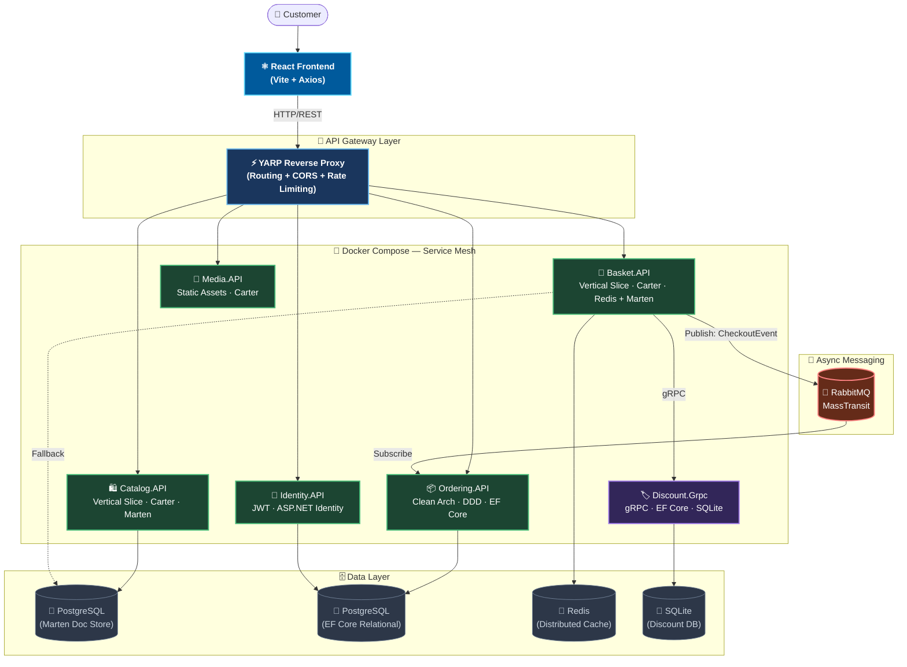

<div align="center">

# 🛒 Instashop
### 🚀 Enterprise-Grade E-Commerce Microservices Platform

[](https://dotnet.microsoft.com/)
[](https://reactjs.org/)
[](https://docker.com/)
[](https://postgresql.org/)
[](https://redis.io/)
[](https://rabbitmq.com/)

**Instashop** is a production-ready, cloud-native e-commerce platform demonstrating the full power of modern architecture. It elegantly combines **Domain-Driven Design (DDD)**, **CQRS**, **Event-Driven Communication**, and a **Hybrid Architecture** strategy — pairing robust backend microservices with a lightning-fast **React** frontend.

[Architecture](#-architectural-topology) · [Features](#-key-features) · [Services](#-microservices-breakdown) · [Tech Stack](#-technology-stack) · [Getting Started](#-getting-started)

</div>

---

## 🌟 Key Features
- **🏗️ Hybrid Microservices Architecture**: Uses Clean Architecture for complex domains (Ordering) and Vertical Slice Architecture for simpler CRUD domains (Catalog, Basket).
- **🔄 Event-Driven Communication**: Services communicate asynchronously using **RabbitMQ** and **MassTransit** to ensure eventual consistency and decoupling.
- **📸 Microservices Snapshot Pattern**: Ensures historical data integrity and inter-service decoupling by snapshotting mutable data (like product names) at the time of order creation.
- **⚡ High-Performance API Gateway**: Centralized routing, rate limiting, and CORS handling using **YARP (Yet Another Reverse Proxy)**.
- **🔐 Secure Authentication**: JWT-based authentication using **ASP.NET Core Identity** and RSA-signed tokens.
- **🚀 Modern React Frontend**: A dynamic, component-based user interface built with React and Vite.
- **📦 Distributed Caching**: Uses **Redis** with the Decorator pattern to massively boost performance for shopping basket operations.
- **📄 NoSQL & Relational DBs**: Polyglot persistence using **Marten (PostgreSQL Document Store)**, **EF Core (PostgreSQL)**, and **SQLite**.

---

## 🏗️ Architectural Topology

The platform is composed of specialized microservices, each isolated in its own bounded context with its own data store. External traffic flows through the **YARP API Gateway**.



---

## ⚙️ Technology Stack

| Domain | Technology | Purpose |
| :--- | :--- | :--- |
| **Frontend** | React 19, Vite, Axios | Modern, responsive SPA for customers |
| **Backend Framework** | .NET 10, C# 12 | Core runtime and language |
| **Routing & Endpoints** | Carter, ASP.NET Minimal APIs | Fast, modular HTTP endpoint definitions |
| **RPC & Microservices**| gRPC | High-perf inter-service communication (Discount) |
| **CQRS Pipeline** | MediatR, FluentValidation | Decoupled feature handlers with auto-validation |
| **NoSQL Database** | Marten (PostgreSQL) | Schemaless JSON document storage (Catalog, Basket)|
| **Relational DB** | EF Core, PostgreSQL, SQLite | Relational modeling (Ordering, Identity, Discount) |
| **Message Broker** | RabbitMQ, MassTransit | Async event-driven communication across contexts |
| **Security** | ASP.NET Identity, JWT (RSA) | Token issuance, secure authentication & authorization|
| **Gateway** | YARP (Yet Another Reverse Proxy)| Centralized routing, rate limiting, and CORS |
| **Infrastructure** | Docker, Docker Compose | Containerization and local service orchestration |

---

## 📦 Microservices Breakdown

1. **🛍️ Catalog Service** (`Catalog.API`)
   - Uses **Vertical Slice Architecture** and **Marten**.
   - Manages product inventory and categories. Features are self-contained slices.
2. **🛒 Basket Service** (`Baket.API`)
   - Uses **Redis** for blazing-fast caching via the **Decorator Pattern**.
   - Manages user shopping carts and communicates with the Discount service via **gRPC**.
3. **📦 Ordering Service** (`Ordering.API`)
   - Implements strict **Domain-Driven Design (DDD)** and **Clean Architecture**.
   - Handles rich aggregates, domain events, and complex business logic.
4. **🔐 Identity Service** (`Identity.API`)
   - Issues RSA-signed **JWT tokens** and manages user roles using ASP.NET Core Identity.
5. **🏷️ Discount Service** (`Discount.Grpc`)
   - High-performance **gRPC** service for coupon management and calculation.
6. **📸 Media Service** (`Media.API`)
   - Handles image and asset uploads for product listings.
7. **🔀 API Gateway** (`YarpApiGateway`)
   - Built with **YARP**. Routes all frontend requests to the appropriate backend service.

---

## 🚀 Getting Started

### Prerequisites
- **Docker Desktop** (v4.x or higher)
- **.NET 10 SDK**
- **Node.js** (v18 or higher for React frontend)

### 1️⃣ Start the Backend Infrastructure
Navigate to the root directory and spin up the entire backend service mesh:
```bash
docker compose up -d
```
*(This starts PostgreSQL, Redis, RabbitMQ, all Microservices, and the YARP API Gateway)*

### 2️⃣ Start the React Frontend
Open a new terminal, navigate to the React app, install dependencies, and run:
```bash
cd frontend-react
npm install
npm run dev
```
The frontend will be available at **http://localhost:5173** and will automatically communicate with the YARP Gateway at **http://localhost:5000**.

### 3️⃣ Apply Entity Framework Migrations (If needed)
If the Ordering or Identity databases require schema updates:
```bash
dotnet ef migrations add <MigrationName> --project Services/Ordering/Ordering.Infrastructure --startup-project Services/Ordering/Ordering.API
docker compose up -d --build ordering.api
```

---

<div align="center">
Built with ❤️ using <strong>.NET 10</strong>, <strong>React</strong>, <strong>DDD</strong>, <strong>CQRS</strong>, and <strong>Microservices</strong>.
</div>
