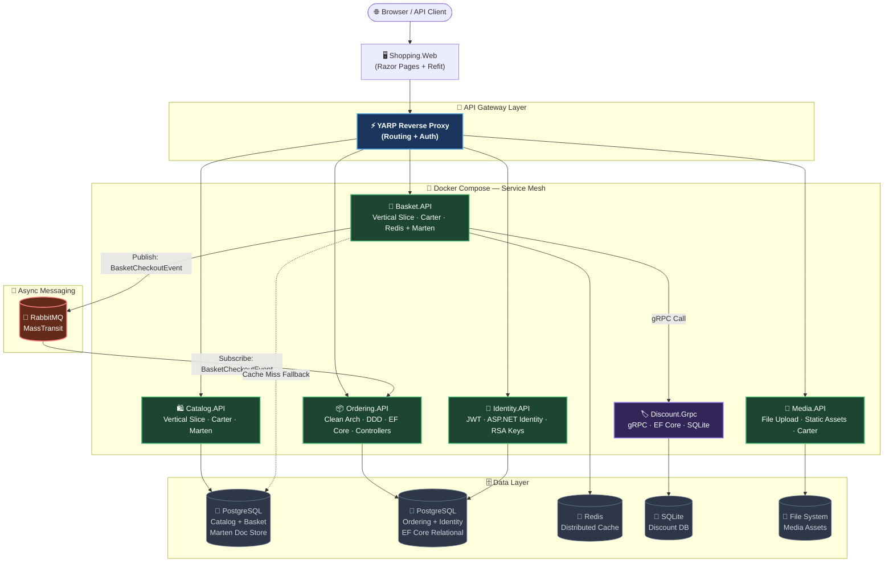
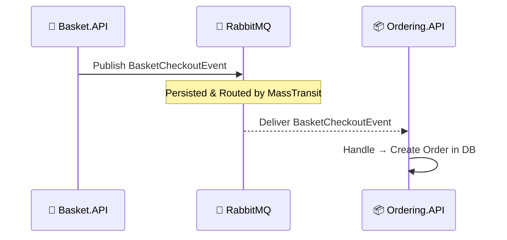
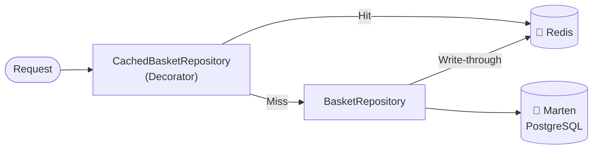
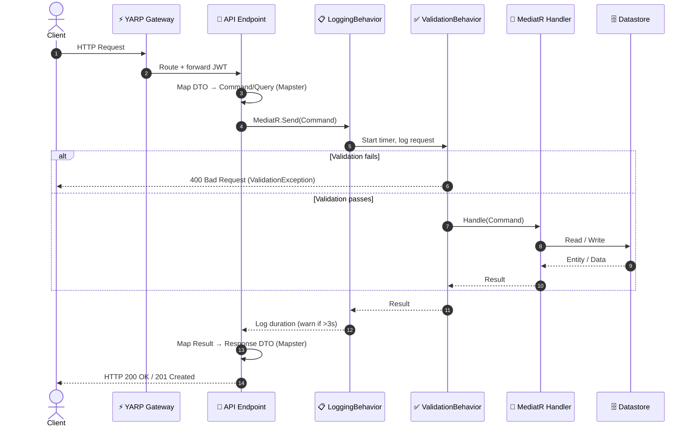

<div align="center">

# 🛒 Instashop

### Enterprise-Grade E-Commerce Microservices Platform

[](https://dotnet.microsoft.com/)
[](https://docker.com/)
[](https://postgresql.org/)
[](https://redis.io/)
[](https://rabbitmq.com/)

**Instashop** is a production-ready, cloud-native e-commerce platform built on **.NET 10** that demonstrates the full power of modern backend architecture. It combines **Domain-Driven Design**, **CQRS**, **Event-Driven Communication**, and a **Hybrid Architecture** strategy — choosing the right pattern for each service's complexity.

[Architecture](#-architectural-topology) · [Services](#-service-breakdown) · [Tech Stack](#-technology-stack) · [Getting Started](#-getting-started) · [API Flow](#-request-pipeline)

</div>

---

## 🏗️ Architectural Topology

The platform is composed of specialized microservices, each isolated in its own bounded context with its own data store. Traffic flows through a **YARP API Gateway** which routes requests to the appropriate service.



---

## ⚙️ Technology Stack

| Component | Technology | Purpose |
| :--- | :--- | :--- |
| **Framework** | .NET 10 | Core runtime |
| **Minimal APIs** | Carter | Catalog, Basket, Media & Identity endpoints |
| **REST APIs** | ASP.NET Core Controllers | Ordering API endpoint routing |
| **RPC** | gRPC | High-perf Discount service communication |
| **Mediator** | MediatR | Thin endpoints; decoupled feature handlers |
| **Document Store** | Marten (PostgreSQL) | Catalog & Basket — schemaless JSON storage |
| **Relational DB** | EF Core + PostgreSQL | Ordering & Identity — relational mapping |
| **Lightweight DB** | EF Core + SQLite | Discount — fast, embedded, zero-config |
| **Distributed Cache** | Redis 7.2 | Basket — decorator-pattern cache layer |
| **Validation** | FluentValidation | Auto-validated on every `IRequest` via pipeline |
| **Mapping** | Mapster | Zero-reflection, code-gen DTO mapping |
| **Message Broker** | RabbitMQ + MassTransit | Async events across bounded contexts |
| **Identity & Auth** | ASP.NET Identity + JWT (RSA) | Token issuance, role-based access |
| **API Gateway** | YARP | Centralized routing, auth forwarding |
| **Frontend** | Razor Pages + Refit | Type-safe HTTP client, server-side UI |
| **Containerization** | Docker + Docker Compose | Full local service mesh |

---

## 🧩 Architectural Patterns

### 1 · Hybrid Architecture Strategy

Each service adopts the architecture that best fits its complexity:

| Service | Architecture | Rationale |
| :--- | :--- | :--- |
| `Catalog.API` | **Vertical Slice** | Simple CRUD with no cross-cutting domain logic |
| `Basket.API` | **Vertical Slice** | Fast, feature-isolated cart operations |
| `Discount.Grpc` | **gRPC Service** | Protocol-buffer contract for low-latency RPC |
| `Ordering` | **Clean Architecture + DDD** | Complex domain rules, rich aggregates, events |
| `Identity.API` | **Minimal API** | Focused auth concerns, Carter routing |
| `Media.API` | **Minimal API** | Single-responsibility file I/O |

### 2 · CQRS — Command Query Responsibility Segregation

Every service strictly separates reads from writes using **MediatR**:

```
HTTP Request
    └── Thin Endpoint (Carter / Controller)
            └── MediatR.Send(Command | Query)
                    └── Pipeline Behaviors
                            ├── LoggingBehavior      → Timing + structured logs
                            └── ValidationBehavior   → FluentValidation on every IRequest
                                    └── Handler (ICommandHandler | IQueryHandler)
                                            └── Datastore (Marten / EF Core / Redis)
```

### 3 · Domain-Driven Design (Ordering Service)

```
OrderingDomain/
├── Abstractions/     IAggregate, IEntity, IDomainEvent
├── Models/           Order (Aggregate Root), OrderItem, Customer, Product
├── ValueObjects/     Address, Payment, OrderName, OrderId, OrderItemId
├── Events/           OrderCreatedEvent, OrderUpdatedEvent
└── Exceptions/       NotFoundException, DomainException
```

The `Order` aggregate root enforces all invariants. State changes (add item, update item, remove item, update status) go through aggregate methods — never by mutating child entities directly.

### 4 · Event-Driven Communication



---

## 📦 Service Breakdown

### 🛍️ Catalog Service
> **Pattern:** Vertical Slice · **DB:** Marten (PostgreSQL)

Manages product inventory, categories, and image hosting. Features are organized as self-contained vertical slices — each slice owns its endpoint, MediatR handler, FluentValidation rules, and models.

```
Catalog.API/Products/
├── CreateProduct/    Endpoint + Command + Handler + Validator
├── UpdateProduct/    Endpoint + Command + Handler + Validator
├── DeleteProduct/    Endpoint + Command + Handler
├── GetProducts/      Endpoint + Query  + Handler  (Paginated)
└── GetProductById/   Endpoint + Query  + Handler
```

---

### 🛒 Basket Service
> **Pattern:** Vertical Slice · **DB:** Redis (cache) + Marten (source of truth)

Shopping cart management with a **Decorator-Pattern** caching strategy and real-time discount application via gRPC.



---

### 🏷️ Discount Service
> **Pattern:** gRPC · **DB:** EF Core + SQLite

High-performance coupon service exposing a Protocol Buffer contract. The Basket service calls it synchronously at checkout time to apply real-time discounts.

**RPCs:** `GetDiscount` · `CreateDiscount` · `UpdateDiscount` · `DeleteDiscount`

---

### 📦 Ordering Service
> **Pattern:** Clean Architecture + DDD · **DB:** EF Core + PostgreSQL

The platform's most sophisticated service. Order processing follows strict DDD rules: business invariants live in the domain, application handlers orchestrate use cases, and infrastructure implements persistence abstractions.

| Layer | Responsibility |
| :--- | :--- |
| `OrderingDomain` | Aggregates, value objects, domain events, exceptions |
| `Ordering.Application` | CQRS commands/queries, MediatR handlers, `IApplicationDbContext` |
| `Ordering.Infrastructure` | EF Core configs, `AuditableEntityInterceptor`, `DispatchDomainEventInterceptor`, migrations |
| `Ordering.API` | Thin controllers → MediatR pipeline |

**Full Order Editability:** All order fields are editable post-creation — customer info, addresses, payment details, order status, and individual order items (add, update quantity/price, remove).

---

### 🔐 Identity Service
> **Pattern:** Minimal API (Carter) · **DB:** EF Core + PostgreSQL

Issues signed **JWT tokens** using **RSA keypairs**. Manages user registration, login, and role assignment (e.g., `Admin`, `Manager`, `Customer`). Policies like `ManagerOrAdmin` are consumed by other services through the shared `BuildingBlocks` auth extensions.

---

### 📸 Media Service
> **Pattern:** Minimal API (Carter) · **DB:** Local File System

Handles all media asset operations. Provides `POST /api/media/upload` and `DELETE /api/media/{fileName}` endpoints. Catalog products reference image URLs served from this service.

---

### 🌐 Shopping Web
> **Pattern:** Razor Pages · **Client:** Refit (type-safe HTTP)

The customer-facing storefront. Runs **outside Docker** for rapid development cycles. Calls all backend services through the YARP gateway using strongly-typed Refit interfaces.

---

## 🧩 BuildingBlocks — Shared Core

All cross-cutting concerns are centralized in the `BuildingBlocks` library, consumed by every service:

| Concern | Implementation |
| :--- | :--- |
| **CQRS Abstractions** | `ICommand<T>`, `IQuery<T>`, `ICommandHandler<,>`, `IQueryHandler<,>` |
| **Validation Pipeline** | `ValidationBehavior<TReq,TRes>` — runs FluentValidation on every `IRequest` |
| **Logging Pipeline** | `LoggingBehavior<TReq,TRes>` — structured logs + ⚠️ warns if > 3 seconds |
| **Exception Handling** | `CustomExceptionHandler` — RFC 7807 `ProblemDetails` for all domain errors |
| **JWT Auth** | `AuthenticationExtensions` — shared bearer scheme + role policies |
| **Async Messaging** | `BuildingBlocks.Messaging` — MassTransit + RabbitMQ event bus abstractions |

---

## 🚀 Request Pipeline (End-to-End)



---

## 🐳 Getting Started

### Prerequisites

| Tool | Version |
| :--- | :--- |
| Docker Desktop | ≥ 4.x |
| .NET SDK | 10.0 |
| (Optional) pgAdmin | Latest |

### 1 · Start Infrastructure & All Services

```bash
# From the solution root
docker compose up -d
```

This starts: **PostgreSQL** · **Redis** · **RabbitMQ** · **All Microservices** · **YARP Gateway**

### 2 · Run the Frontend Locally

```bash
# Shopping.Web runs outside Docker for fast iteration
dotnet run --project WebApps/Shopping.Web/Shopping.Web.csproj
```

Then open: **http://localhost:5005**

### 3 · Apply Ordering Service Migrations

If the Ordering database has pending schema changes, generate and apply a migration:

```bash
# Generate a new migration
dotnet ef migrations add <MigrationName> \
  --project Services/Ordering/Ordering.Infrastructure \
  --startup-project Services/Ordering/Ordering.API

# Rebuild & redeploy the container
docker compose up -d --build ordering.api
```

---

## 📡 Service Ports

| Service | Internal Port | Exposed Port |
| :--- | :--- | :--- |
| YARP API Gateway | 8080 | **5000** |
| Catalog.API | 8080 | 6000 |
| Basket.API | 8080 | 6001 |
| Discount.Grpc | 8080 | 6002 |
| Ordering.API | 8080 | 6003 |
| Identity.API | 8080 | 6004 |
| Media.API | 8080 | 6005 |
| Shopping.Web | — | **5005** (local) |
| PostgreSQL | 5432 | 5433 |
| Redis | 6379 | 6379 |
| RabbitMQ | 5672 | 5672 |
| RabbitMQ Management | 15672 | **15672** |

---

## 📂 Solution Structure

```
Instashop/
├── ApiGateways/
│   └── YarpApiGateway/               # YARP routing config + auth forwarding
│
├── BuildingBlocks/
│   ├── BuildingBlocks/               # CQRS abstractions, pipeline behaviors,
│   │                                 # exception handler, auth extensions
│   └── BuildingBlocks.Messaging/     # MassTransit + RabbitMQ event bus
│
├── Services/
│   ├── Catalog/
│   │   └── Catalog.API/              # Vertical Slice, Marten
│   │       ├── Products/             # Feature slices (Create/Update/Delete/Get)
│   │       └── Models/
│   │
│   ├── Basket/
│   │   └── Baket.API/                # Vertical Slice, Redis + Marten
│   │       ├── Basket/               # Feature slices (Store/Get/Checkout)
│   │       └── Data/                 # Repository + CachedBasketRepository (Decorator)
│   │
│   ├── Discount/
│   │   └── Discount.Grpc/            # gRPC, EF Core + SQLite
│   │       ├── Protos/               # discount.proto
│   │       ├── Services/             # DiscountService (gRPC handlers)
│   │       └── Data/                 # DiscountContext + seeder
│   │
│   ├── Media/
│   │   └── Media.API/                # Minimal API, Local Storage
│   │
│   ├── Ordering/                     # Clean Architecture + DDD
│   │   ├── OrderingDomain/           # Aggregates, ValueObjects, Events, Exceptions
│   │   ├── Ordering.Application/     # Commands, Queries, DTOs, IApplicationDbContext
│   │   ├── Ordering.Infrastructure/  # EF Core, Interceptors, Migrations, Seeder
│   │   └── Ordering.API/             # Controllers → MediatR
│   │
│   └── Identity/
│       └── Identity.API/             # JWT (RSA), ASP.NET Identity, PostgreSQL
│
├── WebApps/
│   └── Shopping.Web/                 # Razor Pages, Refit HTTP clients
│
├── docker-compose.yml
├── docker-compose.override.yml       # Dev overrides (env vars, port mappings)
└── init-dbs.sql                      # PostgreSQL DB initialization script
```

---

## 💡 Key Development Guidelines

1. **Thin Endpoints** — Endpoints only translate HTTP → Command/Query and return status codes. Zero business logic.
2. **Colocation in Slices** — In `Catalog.API` and `Basket.API`, keep endpoint, handler, command, and validator together in the same feature folder.
3. **Clean Architecture Isolation** — `OrderingDomain` has zero dependencies. `Ordering.Application` only knows about the domain. `Ordering.Infrastructure` implements application abstractions.
4. **Interceptors** — `AuditableEntityInterceptor` auto-stamps `CreatedAt`/`LastModified`. `DispatchDomainEventInterceptor` drains and publishes domain events via `ClearDomainEvents()` before committing.
5. **Aggregate Mutations** — Always update `Order` state through its own methods (`AddItem`, `UpdateItem`, `RemoveItem`). Never mutate `OrderItem` directly.
6. **EF Core Enums** — Always pair `.HasDefaultValue()` with `.HasSentinel((EnumType)0)` to prevent EF Core from treating the CLR default as a pending value.
7. **JSON Serialization** — Register `JsonStringEnumConverter` globally so enum values serialize as strings in all API responses.
8. **Primary Constructors** — Use C# 12 primary constructor syntax for DI (`public class Handler(IApplicationDbContext db)`).

---

<div align="center">

Built with ❤️ using **.NET 10** · **DDD** · **CQRS** · **Microservices**

</div>
