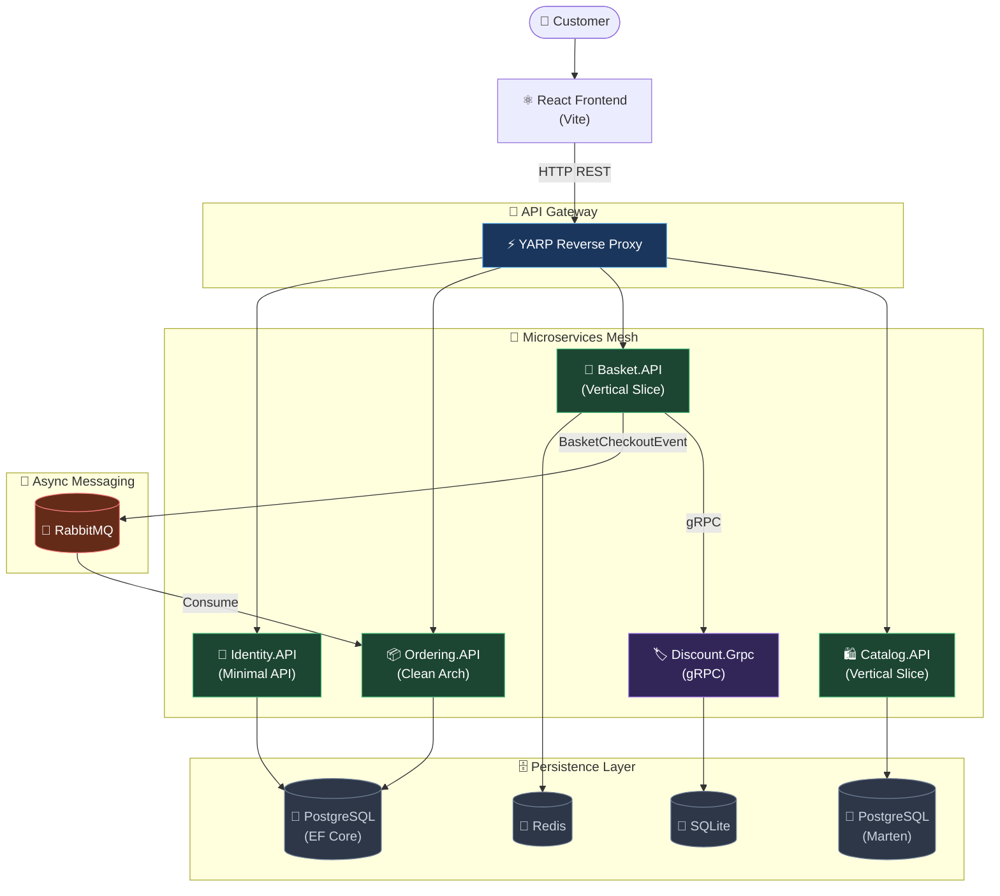

<div align="center">

# 🛒 Instashop
### 🚀 Enterprise-Grade E-Commerce Microservices Platform

[](https://dotnet.microsoft.com/)
[](https://reactjs.org/)
[](https://docker.com/)
[](https://postgresql.org/)
[](https://redis.io/)
[](https://rabbitmq.com/)

**Instashop** is a production-ready, cloud-native e-commerce platform demonstrating the full power of modern architecture. It elegantly combines **Domain-Driven Design (DDD)**, **CQRS**, **Event-Driven Communication**, and a **Hybrid Architecture** strategy — pairing robust backend microservices with a lightning-fast **React** frontend.

[Overview](#-project-overview) · [Features](#-key-features--modules) · [Architecture](#-architecture-highlights) · [Endpoints](#-api-endpoints-summary) · [Getting Started](#-getting-started)

<br/>


*(Placeholder: Add your React Frontend UI screenshots here)*

</div>

---

## 🌟 Project Overview

Instashop is built as a complete reference architecture for developers looking to understand how to build, scale, and maintain enterprise software in **.NET 10**. Rather than forcing a single architectural pattern, the solution uses the **right tool for the right job**. Complex domains use strict Clean Architecture, while simple CRUD services are streamlined with Vertical Slice Architecture.

> [!NOTE]  
> **Development Goal:** Provide a clean, robust, and highly scalable microservices template equipped with real-world complexities like eventual consistency, JWT authentication, and distributed caching.

---

## ✨ Key Features & Modules

- **🛍️ Catalog Service (`Catalog.API`)**: Manages product inventory and categories using PostgreSQL (Marten Doc Store) and Vertical Slice Architecture.
- **🛒 Basket Service (`Basket.API`)**: Blazing-fast shopping cart management. Integrates with **Redis** using the Decorator Pattern to boost caching performance, and communicates with Discount via **gRPC**.
- **📦 Ordering Service (`Ordering.API`)**: The heart of the business logic. Implements strict **Domain-Driven Design (DDD)** and **Clean Architecture**. Handles rich aggregates, domain events, and complex order lifecycles. Includes the **Admin Orders Dashboard** endpoints.
- **🏷️ Discount Service (`Discount.Grpc`)**: High-performance **gRPC** microservice handling coupon validation and discount calculations on the fly.
- **🔐 Identity Service (`Identity.API`)**: Centralized auth provider. Issues RSA-signed JWT tokens and manages users/roles via ASP.NET Core Identity.
- **🔀 API Gateway (`YarpApiGateway`)**: Powered by **YARP (Yet Another Reverse Proxy)**. Handles centralized routing, rate limiting, and global CORS configurations.
- **⚛️ Frontend UI (`frontend-react`)**: A sleek, dark-themed React 19 SPA built with Vite. Features a dynamic checkout flow, infinite CSS marquees, and a fully functional Admin Orders Dashboard.

---

## 🏗️ Architecture Highlights

### Hybrid Architecture & CQRS
- **Vertical Slice Architecture**: Used in `Catalog` and `Basket`. Endpoints, MediatR commands, handlers, and validators live side-by-side to maximize cohesion.
- **Clean Architecture & DDD**: Used in `Ordering` to protect complex domain invariants. The `OrderingDomain` is completely isolated from infrastructure layers.
- **CQRS (Command Query Responsibility Segregation)**: Strict separation of read (Queries) and write (Commands) paths using **MediatR**.

### Cross-Cutting Concerns (BuildingBlocks)
- **MediatR Pipeline Behaviors**: Every request is intercepted by a `ValidationBehavior` (FluentValidation) and a `LoggingBehavior`.
- **Global Exception Handling**: A centralized interceptor maps custom exceptions to RFC 7807 compliant `ProblemDetails`.

### Event-Driven Messaging
Services are decoupled using **RabbitMQ** and **MassTransit**.
Instead of fragile synchronous HTTP calls, cross-service interactions (like `BasketCheckoutEvent`) are published to message queues ensuring **eventual consistency** and high fault tolerance.

### Architectural Flowchart


---

## 📡 API Endpoints Summary

Below is a snapshot of the core endpoints exposed through the **YARP Gateway** (`localhost:5000`):

| Service | Method | Endpoint | Description | Auth Required |
|---------|--------|----------|-------------|---------------|
| **Catalog** | `GET` | `/products` | Retrieve paginated products | ❌ |
| **Catalog** | `POST` | `/products` | Create a new product | ✅ Admin |
| **Basket** | `GET` | `/basket/{username}` | Get user shopping cart | ✅ User |
| **Basket** | `POST` | `/basket/checkout` | Trigger checkout event | ✅ User |
| **Ordering**| `GET` | `/orders` | Retrieve paginated orders | ✅ Admin |
| **Ordering**| `POST` | `/order/status` | Update order status (Enum) | ✅ Admin |
| **Identity**| `POST` | `/auth/login` | Authenticate and retrieve JWT | ❌ |
| **Identity**| `POST` | `/auth/register` | Register a new user | ❌ |

---

## ⚙️ Environment Variables

The backend services rely on the following key environment variables configured in `docker-compose.yml`:

```env
# Global Settings
ASPNETCORE_ENVIRONMENT=Docker

# Database Connections (PostgreSQL)
POSTGRES_USER=postgres
POSTGRES_PASSWORD=postgres
POSTGRES_DB=InstashopDb

# Message Broker (RabbitMQ)
RABBITMQ_DEFAULT_USER=guest
RABBITMQ_DEFAULT_PASS=guest
MessageBroker__Host=amqp://rabbitmq:5672

# Redis Cache
ConnectionStrings__Redis=redis-cache:6379
```

> [!TIP]
> The solution uses `init-dbs.sql` to automatically seed the necessary PostgreSQL databases upon first launch.

---

## 🚀 Getting Started

### Prerequisites
- **Docker Desktop** (v4.x+)
- **.NET 10 SDK**
- **Node.js** (v18+)

### 1️⃣ Spin up the Infrastructure
From the repository root, start all microservices, databases, and the API gateway:
```bash
docker compose up -d
```
*Wait ~30 seconds for RabbitMQ and PostgreSQL to become fully healthy.*

### 2️⃣ Start the React Frontend
Open a new terminal, navigate to the frontend directory, install dependencies, and run the development server:
```bash
cd frontend-react
npm install
npm run dev
```
The web app will now be running at **http://localhost:5173**. It automatically proxies API requests to the YARP Gateway (`http://localhost:5000`).

### 3️⃣ Database Migrations (Local Dev Only)
If you modify the **Ordering** or **Identity** EF Core models, generate and apply migrations:
```bash
dotnet ef migrations add <MigrationName> --project Services/Ordering/Ordering.Infrastructure --startup-project Services/Ordering/Ordering.API
docker compose up -d --build ordering.api
```

---

## 📄 License
This project is licensed under the MIT License. Feel free to use it as a robust template for your own enterprise microservice architectures.
