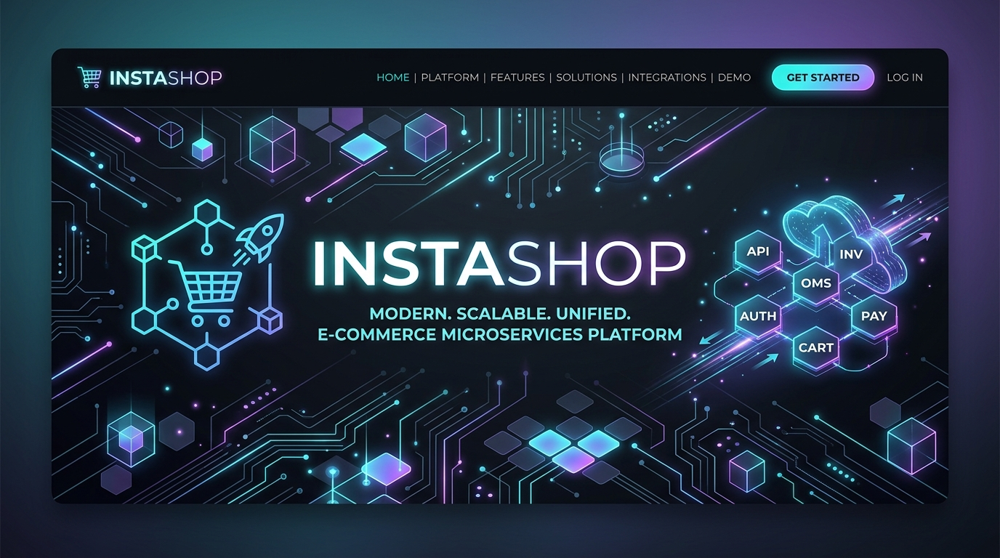
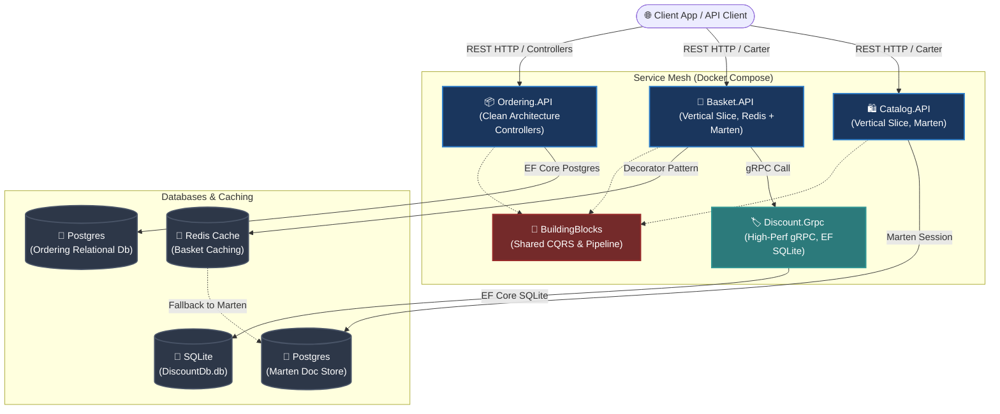
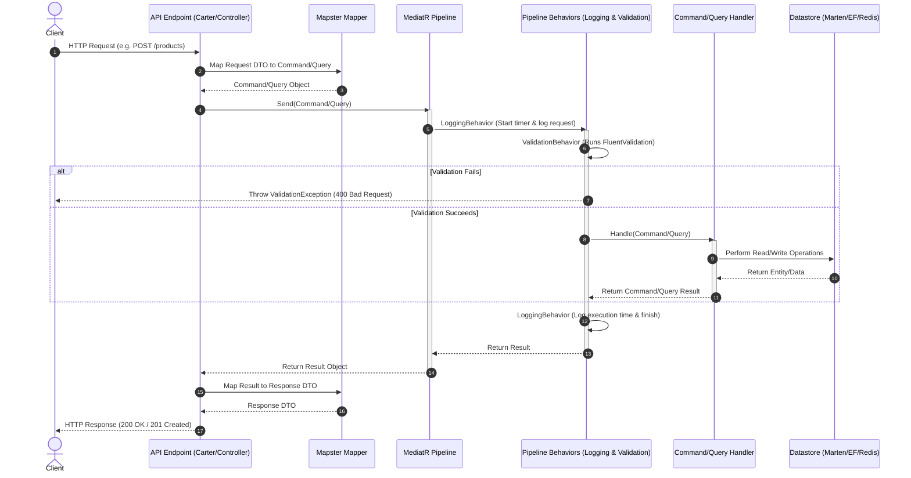
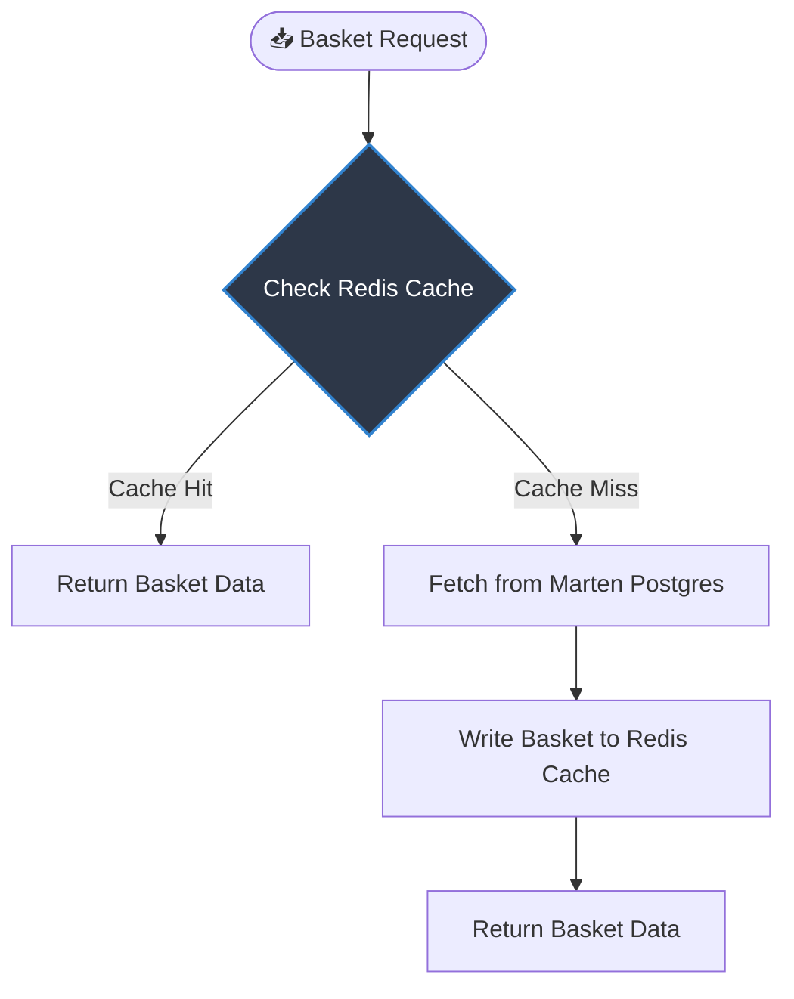

# 🛒 Instashop E-Commerce Microservices



**Instashop** is a state-of-the-art e-commerce microservices platform built using **.NET 10**. This system leverages industry-standard design patterns to achieve high scalability, domain isolation, and optimized performance. The codebase demonstrates a **hybrid architectural approach**—combining **Vertical Slice Architecture** for feature-heavy services and **Clean Architecture (DDD)** for complex enterprise ordering workflows.

---

## 🏗️ Architectural Topology

The following component diagram illustrates how clients interact with the API gateways, how services communicate via RPC (gRPC), and how data stores (Marten Document DB, PostgreSQL Relational, SQLite, Redis Cache) are organized:



---

## 🛠️ Tech Stack & Service Matrix

| Service | Architecture | Primary Technology | Database / Datastore | Key Pattern / Purpose |
| :--- | :--- | :--- | :--- | :--- |
| **`Catalog.API`** | Vertical Slice | .NET 10 Minimal APIs (Carter) | Marten (PostgreSQL Doc Store) | Inventory, catalog pagination |
| **`Baket.API`** | Vertical Slice | .NET 10 Minimal APIs (Carter) | Redis Cache + Marten (PostgreSQL) | Shopping Cart, Caching Decorator |
| **`Discount.Grpc`** | RPC Service | gRPC Server | EF Core + SQLite | High-speed discount coupon lookup |
| **`Ordering`** | Clean Architecture | ASP.NET Core Controllers | EF Core + PostgreSQL | Enterprise DDD, Domain Events, Orders |
| **`BuildingBlocks`** | Shared Core | Library Abstractions | N/A | Cross-cutting concerns, CQRS behaviors |

---

## ⚡ Execution Flow & Request Pipeline

Each service processes incoming requests through a unified pipeline behavior structure defined in `BuildingBlocks`. This flowchart shows how requests are logged, validated, and mapped as they navigate through the application:



---

## 🛍️ Detailed Service Breakdown

### 1. Catalog Service (`Catalog.API`)
Manages the inventory of products. Written using the **Vertical Slice Architecture**, keeping endpoints, MediatR command/query, handlers, and validation rules in feature-specific directories.
* **Storage:** PostgreSQL managed via **Marten** (which exposes PostgreSQL as a high-performance JSON document database).
* **Key Endpoints:** Create Product, Update Product, Delete Product, Get Products (with cursor/offset pagination), Get Product by Category.

### 2. Basket Service (`Baket.API`)
Manages user shopping carts and communicates with the `Discount.Grpc` service to apply coupon codes dynamically.
* **Marten & Redis Caching:** Employs the **Decorator Pattern**. The main database operations are defined in `BasketRepository`, which is wrapped inside a `CachedBasketRepository` that utilizes a Redis distributed cache.
* **Flow Diagram of Caching Strategy:**


### 3. Discount Service (`Discount.Grpc`)
A high-performance gRPC microservice that stores and manages coupon details.
* **Storage:** EF Core mapping to a local SQLite database (`DiscountDb.db`).
* **Protocol Buffers:** Interface defined in [discount.proto](file:///E:/C%23-courses/Microservices_DDD_CQRS_VerticalClean_Architecture_2024/Instashop/Instashop/Services/Discount/Discount.Grpc/Protos/discount.proto) supplying `GetDiscount`, `CreateDiscount`, `UpdateDiscount`, and `DeleteDiscount` RPCs.

### 4. Ordering Service (`Ordering`)
The system's most complex service, implemented using **Clean Architecture** and strict **Domain-Driven Design (DDD)**.
* **Core Domains & Aggregates:** Models customer records, products, order lines, billing/shipping addresses, and payment details.
* **Layer Isolation:**
  * **`OrderingDomain`**: Houses pure business logic, invariants, value objects, domain exceptions, and domain events.
  * **`Ordering.Application`**: Declares CQRS Commands/Queries, MediatR handlers, and database abstractions (`IApplicationDbContext`).
  * **`Ordering.Infrastructure`**: Handles EF Core mapping configurations, custom database migrators, database seed extension, and save changes interceptors (`AuditableEntityInterceptor` and `DispatchDomainEventInterceptor`).
  * **`Ordering.API`**: Exposes standard controllers forwarding payloads to the Application core.

---

## 🧩 Shared Abstractions (`BuildingBlocks`)

The common library provides a solid foundation for cross-cutting concerns:
* **CQRS Core:** Interfaces `ICommand`, `IQuery`, `ICommandHandler`, and `IQueryHandler`.
* **Exception Handling:** Centralized exception middleware mapping domain/system errors to standard Problem Details responses.
* **MediatR Pipeline Behaviors:**
  * `ValidationBehaviour`: Scans the executing assembly for FluentValidation rules and validates requests before handlers run.
  * `LoggingBehavior`: Performance monitoring logs that trigger warning alerts if a request takes longer than 3 seconds.

---

## 🚀 Getting Started & Local Setup

### Infrastructure Prerequisites
To start the backing services (PostgreSQL, Redis, and pgAdmin), execute the docker-compose setup:
```bash
docker-compose up -d
```

### Connection Settings
Update each service's `appsettings.json` connection strings:
* **PostgreSQL (Marten & EF Core):** `"Host=localhost;Database=InstashopDb;Username=postgres;Password=postgres"`
* **Redis Caching:** `"localhost:6379"`
* **gRPC Endpoint URL:** `"http://localhost:5002"`
